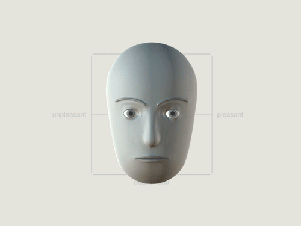
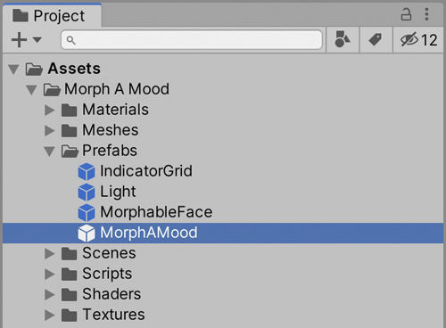
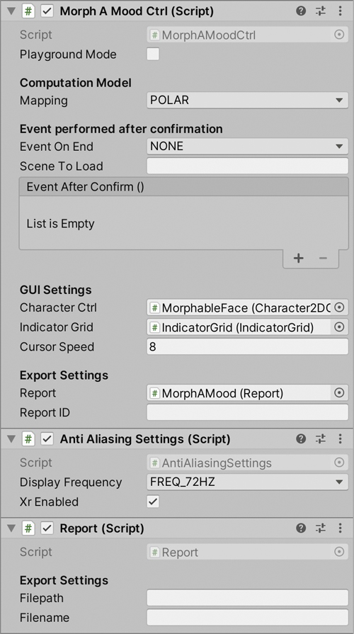
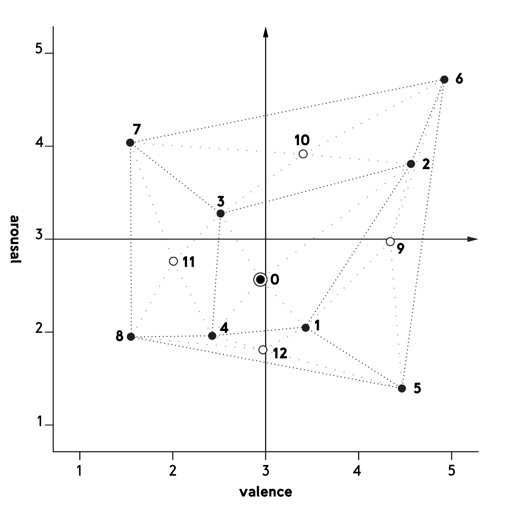
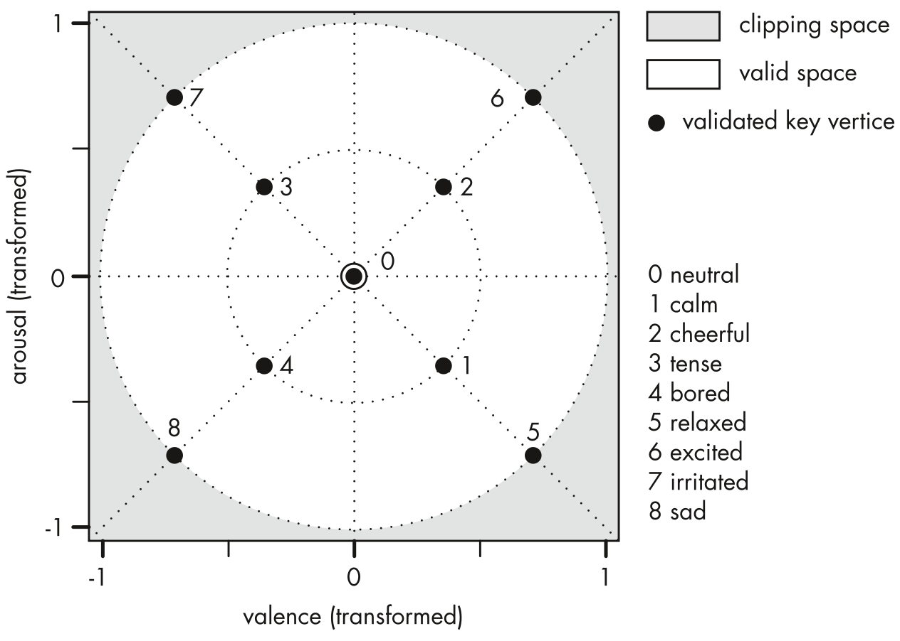

# Morph A Mood (Unity Asset)
**Morph A Mood (MAM) is a pictographic scale for rapid assessment of affective states.**

1. Introduction
2. Some further information
3. Installation
    1. Desktop environment
    2. Oculus VR
4. Computational Models
5. Acknowledgement

## Introduction

Morph A Mood (MAM) is a continuous pictographic scale for rapid assessment of affective states. It was developed to be used in virtual reality, but it can be also used in other environments.
MAM consists basically of a character whose facial expression can be adjusted. This can be operated with a controller gesture using a VR tool kit or on desktop environments with a mouse. It might be also possible to use touch screen devices, this is currently explored at TU Berlin and will be probably extended to this asset in the future, but for now it has not been addressed in the current state of this Unity package.  
Adjusting the facial expression of the character leads to a computation of a valence and an arousal value. Those are reported to a csv file, stored in the application data path.

   

## Installation

Import the *Morph_A_Mood* Unity package into your project. From the top menu, go to *Assets* &rarr; *Import Package* &rarr; *Custom Package*. The *Morph A Mood* asset uses the *TextMesh Pro* package. If it has not already been imported via the Package Manager, you will be automatically prompted to do so (as checked on Unity version 2019.3.3f1), at the latest when you load one of the example scenes or place the *MorphAMood* prefab in your custom scene. So drag the *MorphAMood* prefab into the hierarchy window of your scene (or load one of the example scenes from the *Scenes* directory). When you are asked to load the *TextMesh Pro* package, which you should confirm, it may happen, that the text of the *MorphAMood* interface may be displayed much too large. Just reload the scene or drag the prefab into your scene again and the text should be displayed in normal size.

  

Attached to the prefab *MorphAMood* you will find the script *MorphAMoodCtrl*. The following options are available:  

**Playground Mode** allows you to play around with the character and get familiar with the tool without saving data or quitting by pressing the confirmation button.  

**Event On End** allows to define what happens after the user has confirmed the adjusted expression. You can choose between no event (NONE), defining a callback routine (CALLBACK) or a scene to be loaded afterwards (LOAD_SCENE). Depending on what you choose you must fill in the corresponding field below. This is an exclusive option. It is not possible to load a scene and execute a callback.  

With **Cursor Speed** you can set how sensitive the dot cursor laid over the character reacts on movements of the control device.  

**Report ID** allows to define an identifier of what has been rated. It will be associated with all reported values. This ID may need to be updated automatically when different ratings are performed. You can change this public variable by scripting.

For **saving reports** the script *Report* is included. By default, the filepath is the [application data path](https://docs.unity3d.com/ScriptReference/Application-dataPath.html). On desktop environments you can define your own filepath. Defining a filename is optional. The default filename is the prefix "mam_report_" followed by a timestamp.  

  

#### Desktop environment

On desktop environments you should be able to start after checking the previously mentioned setup. By default, left mouse click is used to enable editing of the character's facial expression. Moving the mouse or stroking the touchpad while holding down the left button will cause changes. Right-clicking (two finger click on macOS) confirms the change and ends the rating.

#### Oculus VR

Import the *Oculus Integration* asset from the Unity Asset Store, go to the top menu: *Window* &rarr; *Asset Store*. It is assumed that you are familiar with the Oculus SDK. You will have to add the player controller by yourself.

To use MAM on Oculus VR kits, you should also consider the previously mentioned setup. By default the primary trigger finger button is used to enable editing of the character's facial expression. Moving the primary controller while keeping trigger button pressed will result in changes. Clicking the touchpad button confirms the change and ends the rating.

By default the scripts are compiled without regard to the Oculus SDK. **To apply the Oculus controller to MAM**, go to the top menu: *Edit* &rarr; *MorphAMood* &rarr; *Enable Oculus SDK*. This will set the preprocessor directive *#define OCULUS* in some scripts. It may take some seconds until the Unity editor detects the changes in the scripts. To speed up the update, simply switch to another application and go back to the Unity editor.

## Some further information

You might ask: what is a *pictographic scale*? What is an *affective state*? And why assess affective states with pictographic scales?  

**Pictographic Scales**  
Well known are scales with alphanumeric text labels – either the ticks labeled with pure numbers as on a temperature scale or with words like "agree" and "disagree". With pictographic scales, the symbols that mark the scale divisions are pictograms, sometimes additionally labeled with numbers or words, but a scale can also be represented by a selection of pictograms only.  

**Affective state**  
is a generic term for both positive and negative feelings [1, p. 216], this covers both emotions and moods. These differ in duration and in the attribution to causes of the feeling. In theory, an emotion is a short-term, directed feeling, whereas a mood is a longterm, undirected feeling. Affective states can be described with dimensional models. Commonly used dimensions are the valence and arousal measure [2-4]. An affective state can be measured by assessing the degree of pleasure (valence) and the degree of activation (arousal).  

To **assess an affective state with a pictographic scale** the user is asked to choose a pictographic symbol, that represents his/her feeling. The pictograms can be translated into numeric values for the purpose of statistical analysis. An example of a pictographic tool is [Pick-A-Mood](https://diopd.org/pick-a-mood/) (PAM) [2], that asks you to choose a representative cartoon out of a set of nine different expressions. Each cartoon is encoded with a valence and an arousal value that have been obtained as average values during a validation experiment, where participants assessed a valence and an arousal value on a 5 point scale for each cartoon. These associated values place each cartoon in a two-dimensional valence-arousal space. The limitation is the discreteness of this scale. The special aspect of MAM is its continuous pictographic scale. It is achieved through interpolation of also nine basic expressions, the same one used in PAM: *calm, relaxed, cheerful, excited, irritated, tense, sad, bored and neutral*. Interpolation allows to define states between these basic expressions as well as between the valence and arousal values of these. The computation is described in the section *Computational Models*.
Furthermore the 3D character allows a new degree of experience for graphical questionnaires in virtual environments (VEs). VEs displayed on head-mounted displays (HMD) differ from "Window-on-the-world" systems such as desktop computers or mobile phones by tracking the user's position and orientation and by a stereoscopic view. This allows immersive experiences that are distinctive for VEs. The use of a 3D cartoon in MAM approaches these specific graphical characteristics of HMD based VEs.

The validation of the tool is described in [5], the data of the validation experiment is available on [mam.christiankruger.de](mam.christiankruger.de).

[1] Eder, A. and Brosch, T. (2017). Emotion. In Müsseler, J. and Rieger,M. (eds.). Allgemeine Psychologie. Berlin, Heidelberg: Springer, pp. 185–222.

  

[2] Desmet, P.M. A., Vastenburg,M. H. and Romero, N. (2016a). Mood measurement with Pick-A-Mood: review of current methods and design of a pictorial self-report scale. J. Design Research, 14 (3), pp. 241–279.  

  

[3] Bradley, M. M. and Lang, P. J. ( 1994). Measuring emotion:The self-assessment manikin and the semantic differential. Journal of Behavior Therapy and Experimental Psychiatry, 25 (1), pp. 49–59.  

  

[4] Russell, J. A. (2003). Core affect and the psychological construction of emotion. Psychological Review, 110 (1), pp. 145–172.

  

[5] Krüger, C., Kojic, T., Maier, L., Möller, S. and Voigt-Antons, J.-N. (2020). Development and validation of pictographic scales for rapid assessment of affective states in virtual reality. (Publishing information will follow in June 2020)

## Computational Models

As you might see in the drop down menu *Mapping* of the *MorphAMoodCtrl* script, there are two optional models, *POLAR* and *CARTESIAN*, used to interpolate the adjusted expression based on the defined key expressions. By default *POLAR* is selected, because it has been used during the validation experiment of this tool. A general introduction into the interpolation process and a description of the two models is given in the following subsections.

#### The basic idea of expression interpolation

The facial model defined by partitions like mouth, eyelids, eyebrows. In general an expression is characterized by for e.g. a certain angle of the mouth or a specific position of the eyebrows. This means that every partition can transform its geometry according to the specific expression. In the polygon mesh, that is used to model the face, vertices define the geometry of the partitions. Therefore each defined basic expression comes along with a specific constellation of the vertices. Interpolating between two expressions means to interpolate the vertices positions of two specific constellations of vertices.  
Each basic expression holds a feature vector that contains parameters to control the vertex groups of the facial partitions (mouth, eyelids, …). Furthermore it holds a valence and an arousal value. Interpolating a new expression is not only the computation of in-between vertex positions, but also of in-between valence and arousal values. The feature vector holds 24 geometry parameters. So how to interpolate on a 24-dimensional space? This is done by a mapping a two-dimensional space to the 24-dimensional space (or 26-dimensional if including valence and arousal parameters). The valence-arousal space is a two-dimensional map in which the expressions can be placed based on their associated valence and arousal values. For the selection of a custom expression you can place a cursor in this two-dimensional map. The cursor has (variable) coordinates like each basic expression has (constant) local coordinates. Based on the distances between the cursor position to the positions of the neighboured basic expressions, ratios can be computed, to create a custom feature vector for the cursor position by summing up the feature vectors of the neighboured expressions that are weighted with the distance ratios. With the geometry parameters of the mixed (interpolated) feature vector the facial model can be rendered and with the included valence and arousal values a reportable measure is provided.

#### Cartesian Computation Model

A way to map the basic expressions on a two-dimensional space is to use the existing two-dimensional valence-arousal space. The expressions are per se located on this map by their predefined valence and arousal values. Because interpolation inside triangles is comparably easy, a triangle mesh is created between the location vectors of the basic expressions. Interpolation of the feature vector considers in this computational model the triangle in which the cursor is located. Each vertex of a triangle represents an expression. Interpolation of the cursor's feature vector is simply the sum of the weighted feature vectors associated to the triangles constant vertices (which represent the basic expressions). The weights are simply the ratios of the areas subdivided by the cursor point to the area of the total triangle. A valence and an arousal value don't need to be interpolated in this model, since the cursor coordinates are identical to these. This is an advantage.
A disadvantage is, that if basic expressions lay very close to each other in the valence-arousal space, interpolation between those lead to changes of the facial expression appearing to be faster and abrupt. The Polar computation model approaches a more fluent morphing behaviour.

  

#### Polar Computation Model
Whereas the Cartesian computation model described in the section above operates on the valence and arousal dimensions, the Polar computation model uses a transformation of these dimensions setting the range per axis between -1 and 1. In the Cartesian model a triangle mesh works as a grid system. In the Polar model a circular grid is set with two rings around the coordinate origin with the radius 0.5 and 1. The ring is partitioned with equal angular segments. By visual inspection of the Cartesian map and comparing the basic expressions you might see already a ring-alike structure. There is a group of four expressions inside a another group of also four expressions. In some cases an inner-ring expression seems to be a mild version of the closest outer-ring expression, like for example *cheerful* and *excited* or *calm* and *relaxed*. This observation has lead to the simplification of the Polar map which associates equal angles (in polar coordinates) to related expressions, that are located in the same quadrant of the valence-arousal space.
In the Polar map the expression vertices are approximately equidistant, which results in a more fluent morphing behaviour, because the gradual changes during interpolation of the basic expressions are similar. Also the detection of the cell, in which the cursor is located, is much easier, because the indices of the corner vertices can be computed straight forward by the angle, whereas in the triangle mesh the detection process has to iterate over the triangles.  
Since the Polar map operates on dimensions unequal the valence-arousal space, also the valence and arousal values of the considered basic expressions are interpolated.

  

## Acknowledgement

Many thanks to Dr.-Ing. Jan-Niklas Voigt-Antons, Tanja Kojic, Martin Josef Burghardt, Alina
Dorsch, Katharina Erben, Christof Grumpelt, Christopher Hyna, Lena Manger, Urszula Przybylska, Tina Schüler and Peter Schwartz for the discussions. In addition, Natalie Romero and her team for providing the PAM cartoons as well as the DEAP research team for granting access to their database, which both, cartoons and database, were essential for the development and the validation experiment.
Finally, many thanks to all the volunteers who took part in the online study and the experiment, and to all the author's friends and family who helped to recruit test subjects.
